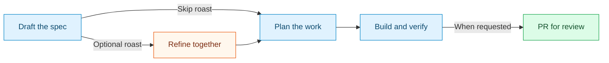
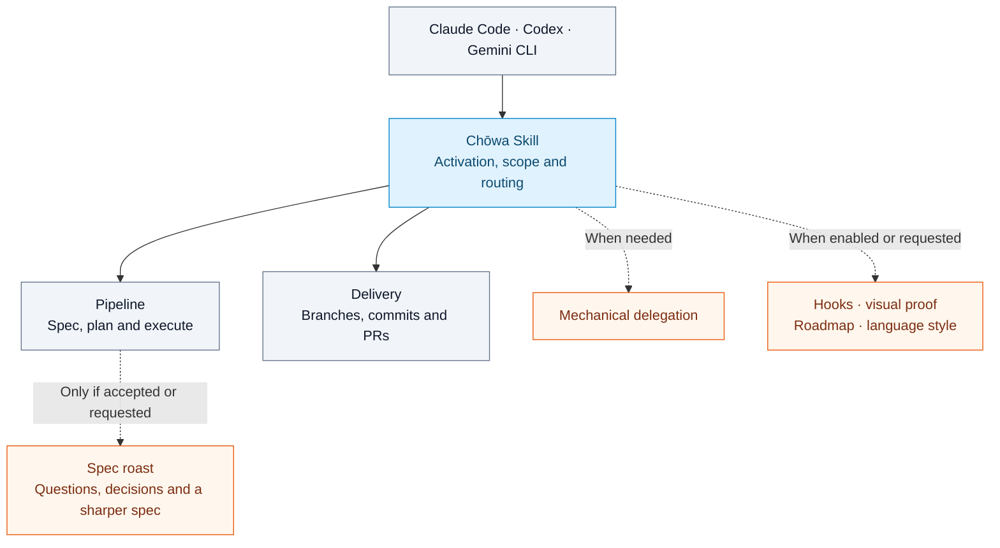

# Chōwa Skill (調和)

> *Harmony from idea to pull request* — A skill that helps your coding agent
> turn a rough idea into a clear spec, a practical plan, and changes you can review.

Chōwa Skill brings a shared workflow to **Claude Code, Codex, and Gemini CLI**.
Your specs, decisions, and tasks live alongside the code, so the next session
can pick up from a written plan. Want tougher questions before you build?
Ask for a **spec roast**. Ready to ship? Work through focused changes, run your
project's checks, and prepare a pull request that tells the story.

[Get started](#install-the-skill) · [Try a spec roast](#optional-spec-roast) ·
[See how it fits together](#how-it-fits-together)

## Why Chōwa Skill?

- **Get clear before coding.** Turn an idea into testable requirements. An
  optional spec roast challenges the assumptions and edge cases with you.
- **Keep your place.** Save specs, plans, and task checklists in the repository.
  Resume from recorded decisions instead of reconstructing them from chat.
- **Make review easier.** Group work into atomic commits, explain the resulting
  behavior in the PR, and report what was actually verified.
- **Bring your preferred agent.** Use the same skill with Claude Code, Codex,
  or Gemini CLI, using each host's native tools.

## From idea to review



Follow the stages you request. Already have an approved plan, or only need a
commit or PR review? Chōwa joins at that stage. The spec roast is optional,
and you can stop it at any time.

## Install the skill

Copy the complete [`skills/chowa-skill/`](skills/chowa-skill/) directory into
one of your host's skill locations. Keep its `references/`, `scripts/`, and
`hooks/` subdirectories together; the skill has no dependency on the checkout
that supplied it. Restart the host or reload skills after installation.

| Host | This project | All your projects |
|---|---|---|
| Claude Code | `.claude/skills/chowa-skill/` | `~/.claude/skills/chowa-skill/` |
| Codex | `.agents/skills/chowa-skill/` | `~/.agents/skills/chowa-skill/` |
| Gemini CLI | `.gemini/skills/chowa-skill/` | `~/.gemini/skills/chowa-skill/` |

For Gemini, you can also use its native installer:

```bash
gemini skills install https://github.com/franprince/chowa-skill --path skills/chowa-skill --scope user
```

Invoke the skill by name using the host's skill picker or ask it to use Chōwa
Skill. Gemini asks for consent when activating a skill. Workspace skills and hooks
require a trusted project; an untrusted project can show no skills even after
a successful install. Installation and activation follow each host's permissions.
See the native [Claude Code](https://code.claude.com/docs/en/skills),
[Codex](https://learn.chatgpt.com/docs/build-skills), and
[Gemini CLI](https://geminicli.com/docs/cli/skills/) skill documentation.

### Optional Claude Code plugin

The plugin adds automatic hook discovery and a Claude mechanical subagent:

```text
/plugin marketplace add franprince/chowa-skill
/plugin install chowa-skill@chowa-skill
```

Install through either the plugin or the standalone skill path to avoid
duplicate discovery. The standalone skill uses available native delegation or
executes inline when subagents are unavailable. It does not require a specific
agent name, model, task tracker, or question tool on other hosts.

## Workflow activation

The workflow applies when the project contains `specs/INDEX.md` or
`chowa.config.js`, `chowa.config.ts`, or `chowa.config.mjs`; when personal
`~/.chowa-skill/preferences.json` contains `"alwaysOn": true`; or when the
user explicitly requests it. Conversation-only activation becomes visible
to the stateless spec-location hook once the pipeline creates the index.
Unrelated projects retain their own conventions.

The agent reads preferences when the skill is first loaded in a session.
`alwaysOn` does not itself install a session-start hook. The optional `ste100`
style preference applies to conversation prose; an explicit project boolean
in `chowa.config.js` overrides the personal value. Preference updates preserve
other settings.

Requests enter at the relevant workflow stage. A request to plan and implement
supplies authorization for that scope; an existing PR-creation request does
not require another approval question. Visual proof is experimental and
requires an explicit user request or a standing project instruction.

## Optional spec roast

After drafting a feature spec, the skill offers once before planning:

> Want a spec roast before planning? I’ll challenge the assumptions, edge
> cases, and acceptance criteria. You can skip it or stop at any time.

Accept to get focused rounds of one to three questions, with recommendations
and tradeoffs. The agent researches available facts and writes your decisions
into the spec. A short pass defaults to at most three rounds, followed by a
summary for confirmation. Further rounds require your choice.

Ask directly to “roast this spec” to opt in immediately. Decline to continue
with normal clarification, or stop the interview whenever you want. An
unanswered offer waits for your choice. The spec records progress so resuming
work preserves your answers and does not repeat an accepted or declined offer.
Existing approved plans and standalone commit/PR requests skip the offer.

## How it fits together

One skill is the front door. Its entrypoint handles activation, scope, and
routing, then reads the procedure needed for the current task.



The boxes are local procedure files inside the skill directory. They load on
demand; loading a file does not start a separate agent. Installed hooks run
through the host's hook system independently of these procedure files.

This keeps one self-contained installation across all three hosts. Separate
skills are useful when a capability needs independent discovery and reuse
outside this workflow. They are not required to defer loading a procedure, and
would add installation dependencies and potentially overlapping triggers.
Modularity reduces initial context; it does not guarantee that previously read
instructions leave the conversation context.

## Optional hooks and helpers

The workflow uses native file and shell tools plus `git` and, for GitHub PRs,
`gh`. Bundled helper scripts require **Node.js 22 or newer** on PATH. The
Storybook collector additionally uses the target project's existing Storybook
and Playwright setup, only when explicitly requested.

Standalone skill discovery does not activate hooks. From the target project,
use the absolute path to your installed skill directory:

```bash
node /absolute/skill-root/scripts/install-hooks.mjs --harness codex --scope project --dry-run
node /absolute/skill-root/scripts/install-hooks.mjs --harness codex --scope project
```

Choose `claude`, `codex`, or `gemini`; an existing Antigravity adapter is also
included. Omit `--scope project` for user configuration. Installation preserves
unrelated hook entries. Codex user installs respect `CODEX_HOME`; review and
trust installed or changed commands with `/hooks`, and trust the project for
project configuration. Reload or restart the host as required by its settings.

Claude Code plugin installation discovers its hooks automatically. Do not also
install the standalone hook adapter for the same scope.

Push/merge protection applies in every project; spec-location protection
requires persistent opt-in. Claude can request approval; Codex and Gemini deny
recognized blocked actions. Hooks check supported command and path shapes;
unsupported shell constructs or malformed input can defer to normal host
permissions. See [Hook setup](skills/chowa-skill/references/hooks.md) for
contracts and troubleshooting.

## Authoring and generation

`templates/chowa-workflow.md` is the source of truth for workflow prose.
`scripts/generate-skill.mjs` owns frontmatter and generation logic. Root-level
`scripts/` and `hooks/` are canonical runtime sources. Edit those sources, then:

```bash
node scripts/generate-skill.mjs
node --test tests/*.test.mjs
node scripts/generate-skill.mjs --check
```

The generator extracts named `reference:<name>` blocks into `references/`,
numbers the main workflow headings, and copies runtime resources into the
skill directory. Reference names must be safe basenames; blocks must end with
`reference:end` and cannot nest. `--check` verifies every generated artifact,
including missing files. Do not edit generated files directly.

The core has a 7,000-character budget; optional procedures load only when
needed. Tests exercise documented host payloads, hook installation, and helpers
from an isolated copy of the skill. Version metadata in
`.claude-plugin/plugin.json` is updated automatically on `main` after merge.
Do not manually bump it in normal PRs. The largest Conventional Commit impact
since the current release wins: `fix:` → patch, `feat:` → minor, and `!` or a
`BREAKING CHANGE:` footer → major. Documentation-only changes do not trigger a
release. Review the final squash commit message because automation uses its
classification, not the affected file extensions.

The workflow publishes annotated version tags explicitly. If a historical tag
is missing, it recovers the boundary only from a matching release commit whose
manifest transition is verified. After a release, check the workflow, manifest,
and remote tag together. See [AGENTS.md](AGENTS.md) for the contributor rules.

## License

MIT
