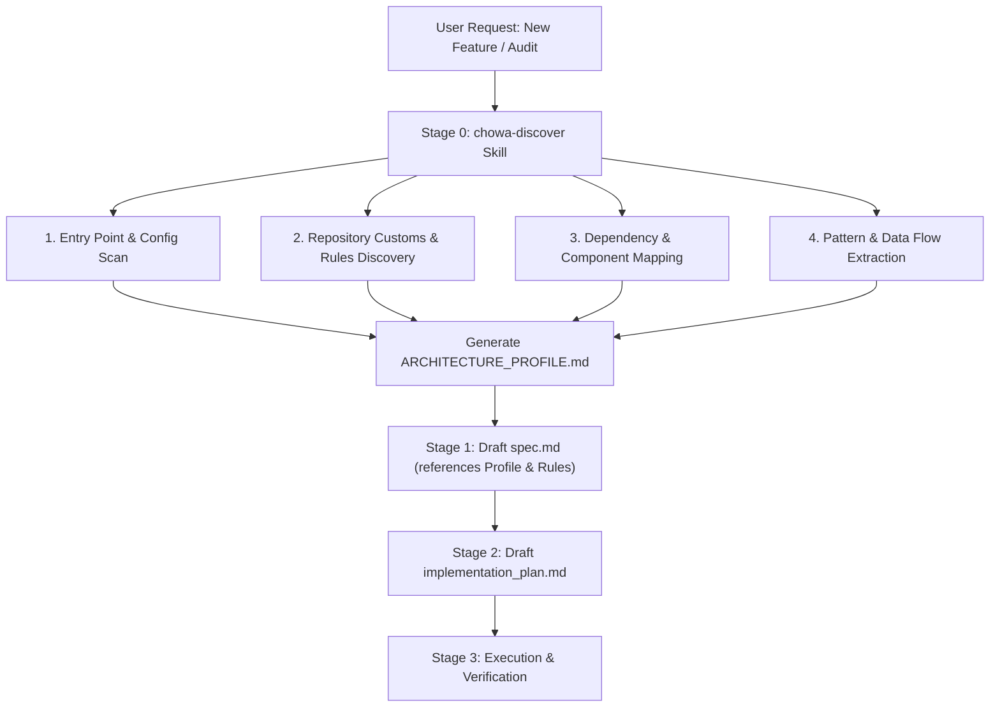

# Spec: Codebase Discovery & Architecture Investigation Skill (`chowa-discover`)

**Status:** Done  
**Date:** 2026-08-06  
**Author:** Antigravity / Fran  

---

## 1. Problem Statement

When initiating feature development or refactoring in an existing codebase, AI coding assistants often lack a deep, systematic understanding of the system's underlying architecture, boundaries, conventions, data flows, and hidden constraints. Relying on superficial snippet viewing can lead to:
1. Hallucinated or misaligned component patterns (e.g., introducing new patterns that conflict with established repo conventions).
2. Breaking implicit contracts between layers (e.g., adapter vs. core vs. router boundaries).
3. Ignoring repository-specific customs and explicit rules (e.g., branching flow, commit style, test framework preferences, or permission boundaries).
4. Drafted `spec.md` and `implementation_plan.md` files that ignore existing architectural debt or fragile integrations.

Currently, Chōwa provides a robust 3-stage feature development pipeline (Spec → Plan → Execute), but lacks a dedicated, standardized pre-planning investigation skill to discover project architecture, repo customs, and workflow rules, producing structured feedback specifically consumable by Chōwa's Stage 1 (`spec.md`) and Stage 2 (`implementation_plan.md`).

---

## 2. Goals & Non-Goals

### Goals
- **Systematic Codebase Audit**: Define a specialized skill (`chowa-discover`) that performs structured discovery of unfamiliar or complex codebases.
- **Architectural & Rule Extraction**: Automatically discover component hierarchies, module boundaries, entry points, configuration schemas, dependency graphs, state flows, error handling patterns, AND repository customs/rules (e.g. `.agents/AGENTS.md`, `.claude/CLAUDE.md`, `CONTRIBUTING.md`, `.cursorrules`, branch strategy, test patterns).
- **Planner-Compatible Feedback Output**: Produce a standardized `ARCHITECTURE_PROFILE.md` (or inline context summary) formatted explicitly for Chōwa's main spec generator and implementation planner.
- **Spec & Plan Integration**: Enhance Stage 1 (`spec.md`) and Stage 2 (`implementation_plan.md`) workflows so that feature specifications reference and respect the discovered architectural profile and repo customs.
- **Harness Portability**: Ship the skill across all supported Chōwa targets (Claude Code plugin bundle, self-hosted `.claude/skills/`, and portable `.agents/skills/`).

### Non-Goals
- Replacing runtime debugging tools or memory profilers.
- Refactoring or writing feature code directly inside the discovery skill (the skill is strictly read-only and analytical).
- Generating full UML/documentation sites for external publishing (focus is actionable developer/AI context for planning).

---

## 3. Workflow & Architecture Integration



### Skill Execution Stages
1. **Discovery & Stack Assessment**:
   - Inspect package managers (`package.json`, `bun.lock`, `cargo.toml`, `go.mod`, `pyproject.toml`).
   - Identify build scripts, linters, test runner setups, and type checking rules.
2. **Repository Customs & Rules Inspection**:
   - Locate and parse rule files: `.agents/AGENTS.md`, `.claude/CLAUDE.md`, `CONTRIBUTING.md`, `.cursorrules`, `.windsurfrules`, `.github/` templates.
   - Inspect recent Git log history for branch flow conventions (`fix/*`, `feat/*`, `release/*`), commit message formatting (Conventional Commits, scopes), and PR requirements.
   - Extract mandatory testing rules (e.g. user interaction focus, mock guidelines, test runner flags).
3. **Structural Breakdown & Component Map**:
   - Map directory layout and identify layer boundaries (e.g., Core vs UI vs API vs Database).
   - Identify core domain entities, types, and schemas.
4. **Data Flow & Pattern Extraction**:
   - Trace primary control flows from entry points to side effects.
   - Detect established design patterns (e.g., Factory, Adapter, Strategy, Event-driven).
   - Identify risk zones, technical debt, and strict execution constraints.
5. **Planner Feedback Generation**:
   - Write or update `specs/ARCHITECTURE_PROFILE.md`.
   - Provide explicit "Guidelines for Feature Planning" formatted as structured markdown blocks consumable during Stage 1 (`spec.md`) and Stage 2 (`implementation_plan.md`).

---

## 4. Input & Output Schemas

### Input Parameters
When invoked manually or via subagent, `chowa-discover` accepts:
- `target_path` *(optional)*: Subdirectory or root path to analyze (defaults to project root).
- `focus_area` *(optional)*: Specific module, subsystem, or feature area of interest (e.g., `routing`, `auth`, `state-management`).
- `depth` *(optional)*: Level of analysis (`quick_overview`, `standard`, `deep_audit`). Default is `standard`.

### Output Artifact (`specs/ARCHITECTURE_PROFILE.md`)
```markdown
# Project Architecture Profile

## 1. Executive Summary & Tech Stack
- **Primary Languages & Runtimes**: Node.js / Bun / TypeScript
- **Frameworks & Libraries**: ...
- **Build & Quality Gates**: ...

## 2. Repository Customs & Workflow Rules
- **Rule Files Detected**: `.agents/AGENTS.md`, `.claude/CLAUDE.md`, etc.
- **Branching Flow**: `fix/*` / `feat/*` -> `develop`, `release/*` -> `main`
- **Commit Conventions**: Conventional Commits (`type(scope): message`)
- **Testing & Code Quality Rules**: ...

## 3. Directory Layout & Layer Boundaries
- `src/core/`: ...
- `src/adapters/`: ...
- `src/cli/`: ...

## 4. Core Entities & Type Systems
- Key interfaces, structs, and schemas.

## 5. Key Architectural Patterns & Data Flows
- Control flow diagram / description.
- Established design patterns in use.

## 6. System Constraints & Technical Debt
- Critical invariants that must not be broken.
- Known fragile areas or anti-patterns to avoid.

## 7. Recommendations for Chōwa Feature Planning
- **Module extension points**: Where to add new features.
- **Testing strategy alignment**: How to structure new tests.
- **Convention checklist**: Naming, error handling, and type safety constraints.
```

---

## 5. Acceptance Criteria

1. **Skill Definition**:
   - A dedicated `chowa-discover` skill template exists in `franprince/chowa-skill` (and is generated for canonical, self-hosted, and portable targets).
2. **Customs & Rules Discovery**:
   - Explicit instructions to inspect `.agents/AGENTS.md`, `CLAUDE.md`, `CONTRIBUTING.md`, git history, and lint/test tooling to capture repo-specific conventions.
3. **Structured Output**:
   - Produces a standardized `specs/ARCHITECTURE_PROFILE.md` file adhering to the defined schema including Section 2 (Repository Customs & Workflow Rules).
4. **Integration with Chōwa Pipeline**:
   - Main `chowa` skill updated to recommend executing `chowa-discover` when starting work on complex/unfamiliar projects prior to Stage 1 `spec.md`.
5. **Verification**:
   - Unit and template sync tests pass via `bun run verify`.
